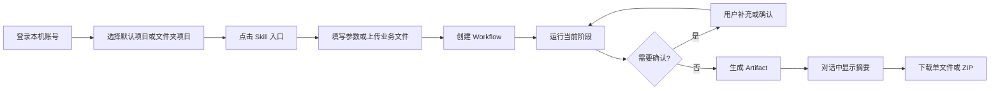

# PRD：基于 Standard AI Workbench 快速开发业务 Skill 应用

## 1. 文档信息

| 项目 | 内容 |
| --- | --- |
| 产品名称 | Standard AI Workbench Skill Application Framework |
| 文档版本 | v1.0 |
| 适用范围 | 基于 `standard_ai_workbench_module` 开发的单 skill 本地桌面应用 |
| 不适用范围 | 多人协作、云端同步、插件市场、在线 SaaS 平台 |
| 核心目标 | 在底座准入能力完成后，将新业务 skill 的开发范围收敛为“业务 adapter + 必要服务 + 少量业务 UI” |

### 1.1 当前基线与准入门槛

本文档分为两个连续阶段：先完成标准底座 v1.1，再创建业务应用。当前底座已经具备账号隔离、项目/对话、模型配置、Tavily、MCP 后端运行时、通用 workflow 表和 Artifact 下载接口；但尚未提供 workflow 业务状态存储、通用 WorkflowPanel、通用 workflow 前端 API client 与文件型 skill 上传骨架。

因此，任何新 skill 项目开始前必须通过下列准入检查。未满足时，应先在 `standard_ai_workbench_module` 完成“底座 v1.1”，不得把缺失能力复制到业务项目中。

| 准入项 | 完成定义 | 验证 |
| --- | --- | --- |
| Workflow state | 已提供受用户归属校验的 JSON 状态读写能力 | 两个账号无法读取对方 workflow state |
| Workflow UI | 已提供创建、运行、确认、取消、错误和成果下载的通用面板 | `example_echo_workflow` 可在 Web/Electron 操作 |
| Workflow API client | 前端已封装 workflow 与 artifact 接口 | 不允许业务 feature 直接拼接 API URL |
| 文件输入骨架 | 已提供上传、进度、格式/大小校验和临时文件清理约定 | 示例文件型 skill 通过上传测试 |
| 异步执行 | 已定义后台任务、状态轮询/事件和取消竞争规则 | 取消后不得写入过期成果 |
| 版本标识 | 底座包含版本号、CHANGELOG 和迁移说明 | 新项目 README 记录基线版本 |

## 2. 背景与问题

当前标书方案助手已经验证了本地 LLM 应用的通用需求：账号登录、项目与对话、模型配置、联网搜索、流式回答、文件输入、阶段确认、成果下载和跨平台桌面打包。若每一个新 skill 都从业务项目复制这些能力，会出现以下问题：

- 登录、数据隔离、模型配置和打包逻辑被反复实现，修复无法同步。
- skill 业务代码与聊天、数据库、Electron 生命周期耦合，后续难以升级。
- 每个项目自行定义阶段状态、文件成果和下载接口，用户体验不一致。
- 业务需求变化时，容易将行业逻辑写入底座，导致底座失去复用价值。

标准底座已经提供通用工作台和 `SkillAdapter + Workflow + Artifact` 基础契约。本 PRD 定义如何在不修改通用核心的前提下，快速开发类似标书方案助手的其他业务 skill 应用。

## 3. 产品目标

### 3.1 目标

1. 底座 v1.1 通过准入后，新 skill 应用可在 3 至 5 个工作日完成最小闭环：输入 -> 分析/生成 -> 人工确认 -> 成果下载。
2. 新项目直接复用本地账号、多租户隔离、模型配置、Tavily 搜索、项目/对话、Markdown 渲染和桌面打包。
3. 业务实现只放在 `backend/skills/<skill_name>/` 与对应的前端 feature 中。
4. 所有 workflow 使用统一的创建、执行、确认、取消、成果列表、单文件下载和 ZIP 下载能力。
5. 一个账号不能读取、修改或下载另一个账号的项目、对话、workflow、artifact、模型配置、Tavily 或 MCP 数据。

### 3.2 非目标

- v1 不实现在线账号体系、组织、成员、角色、邀请、共享项目或云端同步。
- v1 不实现多 skill 插件市场、热加载或远程 skill 下载。
- v1 不强制所有 skill 使用文件上传、联网搜索或 MCP。
- v1 不将业务 prompt、行业模板、解析规则或成果格式写入底座。
- v1 不替代专业业务人员的审核和最终决策。

## 4. 用户与场景

### 4.1 用户角色

| 角色 | 目标 | 使用方式 |
| --- | --- | --- |
| 业务使用者 | 用 AI 完成一项有明确流程的专业任务 | 登录、选择项目、提供输入、确认阶段结果、下载成果 |
| 业务开发者 | 将一个 skill 产品化为本地桌面应用 | 复制底座、实现 adapter、注册入口、编写业务测试 |
| 底座维护者 | 修复通用能力并向后续项目同步 | 维护认证、聊天、存储、Electron、打包与通用契约 |

### 4.2 典型 skill 类型

- 文档分析与报告生成：合同审查、尽调摘要、设计说明、会议纪要。
- 文件驱动型工作流：PDF/DOCX/XLSX 输入，提取信息后经过确认生成成果。
- 内容生产型工作流：调研、提纲、审核、成稿、多个格式成果。
- 专业任务单型工作流：用户填写参数，AI 生成清单、任务书、检查表或说明文件。

## 5. 产品原则

1. **先复用，后扩展**：底座已有的认证、项目、聊天、流式输出、Artifact、ZIP、模型配置和打包能力必须直接使用。
2. **业务不污染底座**：底座只理解 skill 名称、阶段、状态、输入摘要和 artifact；不理解行业术语。
3. **显式确认**：涉及文件解析结果、关键事实、外部工具调用或高成本生成时，默认需要用户确认。
4. **失败不破坏数据**：业务执行失败只将当前 workflow 标记为 `failed`，不得影响项目、对话、模型配置或已生成成果。
5. **用户即租户**：所有业务资源均由当前 `user_id` 约束；跨账号访问统一返回 `404`。
6. **最小数据保存**：只保存 workflow 所需的提取文本、用户确认和成果；原始上传文件默认不长期保存。
7. **可取消、可追溯**：运行中的 workflow 可取消；阶段结果、错误和 artifact 可在当前对话中追溯。

## 6. 总体体验



### 6.1 通用界面分工

| 区域 | 底座职责 | skill 可扩展内容 |
| --- | --- | --- |
| 左侧栏 | 账号、项目、文件夹工作目录、普通对话、搜索、模型配置 | skill 入口的可见性或名称 |
| 输入区 | 普通聊天、模型选择、联网搜索、发送和停止 | 新增 skill 操作入口、上传菜单项、业务参数入口 |
| 消息流 | 用户/LLM 消息、时间、头像、Markdown | 阶段摘要、确认卡片、错误提示 |
| Workflow 面板 | 状态、运行/确认/取消、Artifact 下载 | 阶段名称、业务表单、业务校验提示 |

## 7. 功能需求

### 7.0 开工包与决策表

开发者在复制底座后的第一小时内必须完成下表；未确定的内容不进入编码。

| 决策项 | 必填内容 | 示例 |
| --- | --- | --- |
| skill 名称 | 小写下划线标识 | `contract_review` |
| 主入口 | 输入区的操作名称 | `审查合同` |
| 输入模式 | `text`、`form`、`file` 或组合 | `pdf + docx + text` |
| 文件规则 | 格式、数量、单文件上限 | PDF/DOCX，各 1 个，25MB |
| 阶段 | 阶段名、用户看到的文案、是否确认 | `extract/提取要点/是` |
| 模型策略 | 默认模型、是否允许联网/MCP | 当前模型，联网可选，MCP 禁用 |
| 业务 state | JSON 键及最大长度 | `extracted_text`、`review_notes` |
| 成果 | 文件名规则、kind、MIME | `合同风险报告.md`、`report`、`text/markdown` |
| 失败策略 | 可重试阶段和不可重试错误 | API 超时可重试，格式不支持不可重试 |

创建下列文件后才能开始实现：

```text
backend/skills/<skill_name>/
  __init__.py
  adapter.py
  state.py
  router.py                 # 仅文件/结构化输入需要
  services/
  tests/
frontend/src/features/<skill_name>/
  SkillEntry.tsx
  WorkflowPanel.tsx
  skill.ts
```

文本型 skill 可不创建 `router.py`；文件型 skill 必须创建。不得在 `page.tsx` 中堆叠业务状态机，也不得让业务 adapter 修改通用聊天、认证或 Electron 文件。

### 7.1 应用创建

新项目必须由 `standard_ai_workbench_module` 复制创建，而不是从已有业务项目复制。

创建后仅修改以下应用级内容：

- `package.json`：`name`、`appId`、`productName`。
- `README.md`：业务用途、输入要求、成果说明和打包名称。
- 应用图标、窗口标题、默认数据目录前缀。
- skill 名称、显示名称、入口图标和业务文案。

不得修改以下通用模块来实现业务需求：

- `backend/services/auth.py`
- `backend/services/workbench_store.py` 中的通用项目、对话、用户和模型逻辑
- `backend/services/workbench_llm.py` 的普通聊天主流程
- Electron 本地后端启动、端口分配、CORS 和退出清理逻辑

### 7.2 Skill 注册

每个业务 skill 必须拥有唯一、稳定的小写名称，例如：

```text
contract_review
site_analysis
design_brief_writer
```

在 `backend/skills/registry.py` 注册 adapter。注册信息至少包括：

| 字段 | 说明 |
| --- | --- |
| `skill_name` | 稳定标识，用于存储和 API |
| `display_name` | 用户可见名称 |
| `description` | 简短用途说明 |
| `accepted_inputs` | `text`、`pdf`、`docx`、`xlsx`、`image` 等 |
| `stages` | 业务阶段顺序 |

单 skill 应用默认展示一个主入口；未来多 skill 应用可从同一 registry 中展示多个入口。

### 7.3 Workflow 生命周期

底座统一使用以下状态：

| 状态 | 含义 | 可执行操作 |
| --- | --- | --- |
| `created` | workflow 已创建，尚未运行 | 运行、取消 |
| `running` | 当前阶段执行中 | 取消 |
| `waiting_confirmation` | 等待用户确认或补充 | 确认、取消 |
| `completed` | 已生成成果 | 下载、查看历史 |
| `failed` | 当前 workflow 执行失败 | 查看错误、按业务规则重试或新建 |
| `cancelled` | 用户主动取消 | 查看历史、新建 |

业务阶段名称由 adapter 定义，例如 `extract`、`review`、`draft`、`generate`、`validate`。阶段必须能在 UI 中显示为用户可读文案。

#### 状态转换与异步执行

| 当前状态 | 允许动作 | 目标状态 |
| --- | --- | --- |
| `created` | `run` | `running` |
| `running` | 阶段完成且需确认 | `waiting_confirmation` |
| `running` | 阶段完成且无需确认 | `completed` |
| `running` | 执行异常 | `failed` |
| `waiting_confirmation` | `confirm` | `running` |
| `created` / `running` / `waiting_confirmation` | `cancel` | `cancelled` |
| `failed` | skill 明确支持重试时 `run` | `running` |

底座 v1.1 的执行模型如下：

- `POST /run` 和 `POST /confirm` 返回 `202` 及最新 workflow，不等待长耗时 LLM/文件任务完成。
- 后台任务开始前和写入 state、消息、artifact 前都必须重新读取 workflow；仅状态仍为 `running` 时才能提交结果。
- 前端每 1 秒轮询 `GET /workflows/{id}`，直到进入 `waiting_confirmation`、`completed`、`failed` 或 `cancelled`；后续可升级为 SSE，不阻塞 v1。
- 同一个 workflow 同时只能有一个 `running` 任务。重复运行返回 `409`，不启动第二个任务。
- 取消只保证停止后续写入，不承诺中断第三方模型 HTTP 请求；任务完成后发现已取消时必须丢弃结果。

### 7.4 通用业务状态存储

现有 `Workflow.input_summary` 仅适合展示摘要，不能承载文件提取文本、结构化结果、用户补充、模板选择或业务配置。

底座需增加通用业务状态能力，推荐新增表：

```text
workflow_payloads
  workflow_id       TEXT PRIMARY KEY
  state_json        TEXT NOT NULL
  version           INTEGER NOT NULL DEFAULT 1
  updated_at        TEXT NOT NULL
```

要求：

- `state_json` 只能保存当前 skill 所需的最小数据。
- 所有读写必须先验证 `workflow_id` 属于当前 `user_id`。
- 不在表中创建 `bid_*`、`contract_*` 等业务字段。
- 原始文件内容较大时只保存提取文本或受控路径；不得默认永久保存上传文件。
- adapter 通过 `get_workflow_state()` / `update_workflow_state()` 读写，禁止直接拼接 SQL。
- 单个 `state_json` 上限为 2MB；超过时将大字段拆为受控临时文件或 Artifact，不写入 SQLite。
- 更新必须采用版本号比较，避免运行任务与用户确认同时覆盖对方内容。

底座 v1.1 必须新增以下内部 Store 方法与受保护 API。业务 adapter 优先调用 Store，前端只调用 API：

| 能力 | Store / API |
| --- | --- |
| 读取状态 | `get_workflow_state(user_id, workflow_id)` / `GET /api/v1/workflows/{id}/state` |
| 合并更新 | `update_workflow_state(user_id, workflow_id, patch, expected_version)` / `PATCH /api/v1/workflows/{id}/state` |
| 清理状态 | workflow 删除时级联删除 |

`PATCH` 冲突时返回 `409`，前端重新读取 workflow 与 state 后提示用户刷新，不得静默覆盖。

### 7.5 文件输入

文件输入由具体 skill 自行声明，底座提供上传入口和基础限制。

#### 通用要求

- 上传前显示文件名、格式和大小限制；上传过程显示真实进度。
- 默认单文件上限为 25MB，可由 skill 在合理范围内收紧。
- 上传成功后，前端立即创建或关联 workflow，并显示当前阶段状态。
- 文件解析失败时，返回用户可理解的错误，不创建半完成 artifact。
- 上传接口必须校验当前用户对目标 workflow/conversation/project 的归属。

#### 路由模式

业务文件上传不进入通用聊天接口，推荐使用 skill 专属路由：

```text
POST /api/v1/skills/{skill_name}/workflows/{workflow_id}/inputs
```

该路由只负责接收、校验、解析并写入 workflow state；实际 LLM 阶段执行仍经通用 workflow API 触发。

文件型 skill 必须按以下顺序实现，不允许跳步：

1. 前端先创建 workflow，获取 `workflow_id`。
2. 使用 `XMLHttpRequest.upload.onprogress` 或等价方案上传文件，进度显示为 `0-99%`；后端确认成功后显示 `100%`。
3. 路由从 `current_user(request)` 取得用户，调用 `get_workflow(user_id, workflow_id)` 校验归属和 `skill_name`。
4. 校验文件数量、扩展名、MIME、大小和空文件；将文件写入 `uploads/{user_id}/{workflow_id}/` 临时目录。
5. 调用该 skill 的 `InputService.parse()`，只将提取文本、结构化元数据和受控临时路径写入 workflow state。
6. 解析成功后更新阶段为 `ready` 或业务定义的首阶段；前端再调用 `/run`。
7. 解析失败时删除本次临时文件、保留 workflow 的错误状态，并返回可读错误。

统一上传响应：

```json
{
  "workflow_id": "...",
  "input_id": "...",
  "file_name": "source.pdf",
  "char_count": 12345,
  "stage": "ready"
}
```

临时文件默认在 workflow `completed`、`failed` 或 `cancelled` 后保留 24 小时，由启动时和退出时清理任务删除；如业务需要保留原文件，必须在该业务 PRD 中说明保存期限、用途和用户可见提示。

路由必须位于 `backend/skills/<skill_name>/router.py`，并使用固定模板：

```python
router = APIRouter(prefix="/api/v1/skills/<skill_name>", tags=["<skill_name>"])

@router.post("/workflows/{workflow_id}/inputs")
async def upload_input(workflow_id: str, request: Request, file: UploadFile):
    user = current_user(request)
    workflow = workbench_store.get_workflow(user.id, workflow_id)
    if workflow.skill_name != "<skill_name>":
        raise HTTPException(status_code=404, detail="工作流不存在。")
    return await input_service.save(user.id, workflow, file)
```

底座的 `backend/skills/registry.py` 必须新增 `list_skill_routers()`；`backend/main.py` 启动时遍历并 `include_router()`。不允许业务项目在 `main.py` 中散落手写业务 endpoint。

### 7.6 Adapter 契约

每个 adapter 必须实现现有 `SkillAdapter` 契约，并将 `user_id` 显式传入业务阶段：

```python
class ExampleAdapter(SkillAdapter):
    skill_name = "example_skill"
    display_name = "示例业务 Skill"
    description = "..."
    accepted_inputs = ["text", "pdf"]
    stages = ["created", "analysis", "confirmed", "completed"]

    def load_instructions(self) -> str: ...
    def run_stage(self, user_id: str, workflow: Workflow, input_text: str = "") -> tuple[Workflow, str]: ...
    def confirm_stage(self, user_id: str, workflow: Workflow, text: str = "") -> tuple[Workflow, str]: ...
    def build_artifacts(self, workflow: Workflow) -> dict[str, tuple[str, str, str]]: ...
```

#### Adapter 约束

- `run_stage()` 仅处理当前阶段，不得隐式跳过需要人工确认的阶段。
- `confirm_stage()` 必须校验 workflow 当前确实处于确认阶段。
- `build_artifacts()` 必须返回 `{文件名: (内容, kind, mime_type)}`，由底座统一保存和 ZIP 导出。
- 业务 prompt、模板、规则和解析服务均放在 skill 目录或其子目录。
- 普通聊天仍走 `/api/v1/chat/stream`，不自动进入业务 workflow。

### 7.7 Artifact 与成果下载

每个 skill 可生成一个或多个 Artifact，例如：

| kind | 示例 |
| --- | --- |
| `report` | 分析报告 Markdown |
| `checklist` | 风险检查清单 |
| `brief` | 任务书或设计说明 |
| `data` | JSON、CSV、XLSX 数据成果 |
| `image` | 图片、示意图或缩略图 |

要求：

- Artifact 名称由业务 adapter 决定，但必须过滤路径分隔符和非法文件名字符。
- 单文件下载、artifact 列表和 ZIP 导出统一复用底座接口。
- workflow 完成后，消息流中追加简短完成摘要；下载控件紧跟阶段结果，不放在页面顶部。
- workflow 失败或取消时，已存在的 artifact 不得被误删。

底座必须在保存 artifact 前统一调用 `sanitize_artifact_name()`，规则如下：

- 删除路径分隔符、`..`、控制字符和系统非法字符。
- 文件名为空时拒绝保存；单个名称最大 120 个 Unicode 字符。
- 单个 artifact 默认不超过 20MB，单个 workflow 的 ZIP 总大小不超过 100MB；超限时 workflow 标记为 `failed` 并写入明确错误。
- ZIP 内仅使用已净化的基础文件名，不允许创建目录、软链接或覆盖其他条目。
- `mime_type` 必须来自 adapter 声明白名单；未知类型使用 `application/octet-stream`。

### 7.8 模型、联网搜索与 MCP

- skill 默认复用当前用户选择的 OpenAI-compatible 模型配置。
- 业务需要联网信息时，可让用户在输入区显式开启 Tavily；不得静默进行外部搜索。
- 业务需要 MCP 时，必须复用底座的“模型请求 -> 用户确认 -> 执行 -> 继续生成”流程。
- 业务不得在 adapter 中直接执行任意 shell 命令或访问未确认的 MCP server。
- 未配置 API key、Tavily 或 MCP 时，必须给出缺少配置的准确提示，普通聊天和其他 skill 不受影响。

### 7.9 前端业务扩展

新 skill 的前端代码放在独立 feature 或 component 中，例如：

```text
frontend/src/features/<skill_name>/
  SkillEntry.tsx
  WorkflowPanel.tsx
  InputForm.tsx
  skill.ts
```

要求：

- 复用现有 `api.ts`、`types.ts`、`MarkdownPane`、消息流和通用布局。
- 业务入口放在 composer 工具栏，不替换普通聊天输入能力。
- 业务确认表单只在 workflow 处于 `waiting_confirmation` 时显示。
- 移动端不得让上传菜单、确认面板或下载按钮溢出屏幕。
- 默认不新增营销页、欢迎页或与业务无关的装饰性组件。

底座 v1.1 必须先提供以下组件，业务项目只能组合或轻量扩展，不得重写状态机：

| 组件 | 必须能力 |
| --- | --- |
| `WorkflowPanel` | 轮询状态、运行、确认、取消、失败提示、Artifact 列表和 ZIP 下载 |
| `WorkflowStatus` | 将通用状态和 adapter 阶段映射为用户文案 |
| `WorkflowArtifacts` | 单文件下载、ZIP 下载、空成果和下载失败状态 |
| `workflowApi` | 创建、查询、运行、确认、取消、state、artifact 的统一请求封装 |
| `useWorkflow` | 防重复提交、轮询清理、切换对话时加载对应 workflow |

前端必须将 workflow 卡片渲染在关联消息之后，完成、待确认或失败时自动滚动到卡片；禁止将关键确认或下载按钮固定在页面顶部。

## 8. 数据模型与接口

### 8.1 通用接口

| 接口 | 用途 |
| --- | --- |
| `POST /api/v1/workflows` | 创建 workflow |
| `GET /api/v1/workflows/{id}` | 查询状态和阶段 |
| `POST /api/v1/workflows/{id}/run` | 执行当前阶段 |
| `POST /api/v1/workflows/{id}/confirm` | 提交确认/补充 |
| `POST /api/v1/workflows/{id}/cancel` | 取消 workflow |
| `GET /api/v1/workflows/{id}/artifacts` | 列出成果 |
| `GET /api/v1/workflows/{id}/artifacts/{name}` | 下载单个成果 |
| `GET /api/v1/workflows/{id}/export.zip` | 下载 ZIP |

### 8.2 Skill 专属接口

仅当通用接口不能承载业务输入时新增，并使用统一命名空间：

```text
/api/v1/skills/{skill_name}/...
```

不得新增 `/api/<业务名>/...` 的平行旧接口，也不得让前端绕过通用认证头调用本地后端。

### 8.3 权限规则

| 资源 | 归属校验方式 |
| --- | --- |
| 项目 | `projects.owner_user_id = current_user.id` |
| 对话/消息 | 通过对话所属项目校验 |
| Workflow/Artifact | 通过 workflow 所属项目校验 |
| 模型配置/Tavily/MCP | 资源直接保存 `owner_user_id` 或用户级配置 |
| 搜索 | FTS 索引按 `owner_user_id` 过滤 |

任何不属于当前账号的资源访问均返回 `404`，不得返回“无权限”或泄露资源名称、状态、大小等信息。

## 9. 安全与隐私要求

1. 密码使用 Argon2 哈希，登录失败限流保持有效。
2. 模型 API key 和 Tavily API key 仅存本地数据库，API 响应、日志和 UI 均不得回显完整 key。
3. Electron 使用随机 `APP_AUTH_SECRET` 保护本地 API，前端仅通过 preload 取得后端地址和访问密钥。
4. 本地多账号隔离是应用层隔离，不是数据库加密；README 必须说明同一系统账号可直接访问文件的风险。
5. 原始上传文件、长文本和 artifact 不得写入应用日志。
6. 对外联网、MCP、文件写入或高成本操作必须有用户可见入口和确认语义。
7. 业务 skill 如需保存审计摘要，默认保存在当前用户的数据目录，不发送邮件或上传云端，除非新 PRD 明确提出并经过安全审查。

### 9.1 底座版本与升级

- 底座根目录维护 `WORKBENCH_BASE_VERSION`，采用语义化版本，例如 `1.1.0`。
- 每次底座接口、数据库迁移、前端公共组件或打包链路变化时更新 `CHANGELOG.md`。
- 新业务项目 README 必须记录：基线版本、复制日期、已合并的底座补丁和业务特有改动。
- 底座数据库变更必须使用幂等迁移与 `PRAGMA user_version`；升级前自动备份数据库。
- 业务项目合并新版底座前，先运行底座回归测试，再执行业务 skill 回归测试，不允许只复制单个文件解决冲突。

## 10. 开发计划

### 10.1 新 skill 五日启动清单

下表仅在“1.1 准入门槛全部通过”后适用。每一天结束前必须完成对应验证，不将未验证内容顺延到发布阶段。

| 时间 | 工作项 | 产出 | 验证 |
| --- | --- | --- | --- |
| Day 0 | 填写 7.0 决策表，确定输入、阶段、state、成果和错误策略 | 一页 skill 设计说明 | 业务负责人确认输入与成果 |
| Day 1 | 复制底座，修改应用标识；创建并注册 adapter | 可创建 `created` workflow | `GET /api/v1/skills` 返回 metadata |
| Day 2 | 实现首阶段、state 读写和文本输入；文件型 skill 同时实现上传路由 | 可进入 `waiting_confirmation` | 两账号隔离、错误输入测试通过 |
| Day 3 | 实现确认阶段、artifact、下载和前端 WorkflowPanel 集成 | 可生成一个 Markdown artifact | 单文件和 ZIP 下载通过 |
| Day 4 | 补充业务校验、失败/取消、模型和联网/MCP 可选能力 | 可恢复的失败提示 | 取消后无过期结果，普通聊天不回归 |
| Day 5 | 完成 README、图标、Web/Electron 验收和目标平台打包 | 可分发应用 | 全部必跑命令与人工验收通过 |

最小文本型 skill 的验收路径必须是：

```text
输入文本 -> 创建 workflow -> run -> waiting_confirmation
-> confirm -> completed -> example_result.md -> ZIP 下载
```

最小文件型 skill 在上述基础上增加：

```text
创建 workflow -> 上传文件并显示进度 -> 写入 state -> run
```

### 阶段 A：底座准备

- 完成 workflow state 的通用存储能力。
- 完成通用 `WorkflowPanel` 与 artifact 下载组件。
- 确认多账号、模型配置、Tavily、MCP 和 Electron 打包测试全部通过。

### 阶段 B：新 skill 最小闭环

- 创建 adapter、注册 metadata 和业务 prompt。
- 定义一个文本输入或一个文件输入。
- 实现一个分析阶段、一个确认阶段和一个 Markdown artifact。
- 在 Web 与 Electron 跑通完整闭环。

### 阶段 C：业务完善

- 增加多文件输入、结构化表单、多个成果格式、业务校验和更丰富的阶段 UI。
- 根据业务需要接入联网搜索、MCP、图片处理、DOCX/PPT/XLSX 生成等 service。
- 补充失败重试策略、输入校验和性能优化。

### 阶段 D：发布验收

- 完成 macOS 与 Windows 目标平台打包。
- 验证首次启动、注册/登录、模型配置、workflow、下载和退出后端清理。
- 更新业务项目 README、版本号、图标和分发说明。

## 11. 测试与验收

### 11.1 底座回归

- 注册两个本机账号，验证项目、对话、模型、Tavily、MCP、workflow 和 artifact 相互隔离。
- 用账号 B 访问账号 A 的任意资源 ID，均返回 `404`。
- 验证 workflow state 的读取、版本冲突 `409`、删除级联和 2MB 上限。
- 验证 artifact 文件名净化、单文件 20MB 限制、ZIP 100MB 限制与 ZIP 条目无路径穿越。
- 验证普通 SSE 聊天、停止生成、Markdown 渲染、模型列表和联网搜索。
- 验证 Electron `app://frontend`、随机端口、CORS/private-network、上传进度和退出后端清理。

### 11.2 Skill 验收

- 输入不完整时给出业务可读错误，不创建无效成果。
- 运行阶段写入状态、消息和业务 state。
- 需要确认时不提前生成最终成果。
- 确认后生成预期 Artifact，单文件下载和 ZIP 内容一致。
- 取消后不得写入过期结果。
- 业务执行异常时 workflow 为 `failed`，并保留错误信息与已完成阶段。
- 运行中重复点击运行、确认或上传时，前端禁用重复操作，后端返回一致的 `409` 或业务错误。
- 文件型 skill 覆盖格式不支持、空文件、超限文件、解析失败、临时文件清理和跨账号 workflow 上传。

### 11.3 必跑命令

```bash
npm run test:backend
npm run test:frontend
npm run typecheck
npm --prefix frontend run build
```

## 12. 完成标准

一个新 skill 应用满足以下条件时，视为达到 v1 可交付状态：

1. 未修改通用认证、聊天、项目、模型配置和 Electron 生命周期代码来实现业务逻辑。
2. 1.1 中全部底座准入项已实现并由 `example_echo_workflow` 验证。
3. 业务逻辑集中于 `backend/skills/<skill_name>/` 和独立前端 feature。
4. 用户能从业务入口完成输入、阶段执行、确认和成果下载。
5. 两个本机账号的数据隔离测试通过。
6. Web 与 Electron 均可运行，目标平台打包产物可完成最小闭环。
7. README 说明输入要求、输出成果、本地数据位置、限制、基线版本和打包方式。
