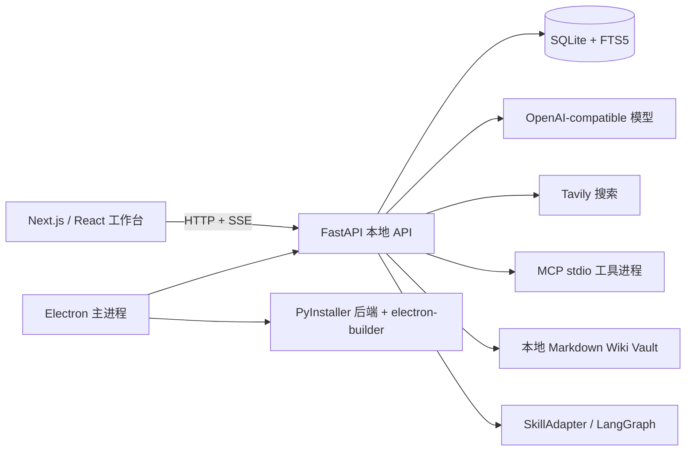

# Standard AI Workbench 项目审查与优化建议

- 审查日期：2026-07-16
- 审查版本：`0.2.2`
- 审查方式：静态代码与依赖、路由、测试、桌面打包配置审查；未进行真实第三方模型、Tavily 或外部 MCP 服务联调。
- 结论：这是一个本地优先的 AI 工作台底座，功能覆盖面已足以承载垂直 Skill 应用。下一阶段的重点应从“继续叠功能”转为安全边界、可靠性、可测试性与模块化。

## 1. 当前架构

- 前端：Next.js 16、React 19、TypeScript、Tailwind/PostCSS；`react-markdown` 负责 Markdown，`rehype-sanitize` 过滤原始 HTML，`lucide-react` 提供图标。
- 后端：FastAPI、Pydantic、Uvicorn、Python stdlib `sqlite3`；所有业务数据写入本机 SQLite，聊天走 SSE。
- 桌面壳：Electron 启动随机端口的本机 FastAPI 子进程，使用 preload/context isolation 暴露少量 IPC。
- 模型与工具：OpenAI Python SDK 直连 OpenAI-compatible Chat Completions；Tavily 通过 `httpx`；外部工具使用本地 stdio MCP。
- 工作流与知识：通用 `SkillAdapter`；LLM Wiki 使用 LangGraph SQLite checkpoint、Markdown vault 和人工确认。
- 发布：根 `package.json` 是版本唯一来源，通过 `sync:version` 同步前端与 lockfile；PyInstaller 构建后端，electron-builder 产出安装包。

## 2. 功能与实现矩阵

| 功能 | 当前实现 | 技术栈 | 审查结论 / 可替代方案 |
|---|---|---|---|
| 桌面应用与本地后端生命周期 | Electron 启动/停止 FastAPI，随机端口与应用密钥保护 | Electron、Node child_process、PyInstaller、electron-builder | 本地优先且部署简单。后续可增加启动诊断页、崩溃重启与健康检查超时提示。 |
| 本机账号与会话 | 注册、登录、改密、8 小时会话、失败限流、账号数据隔离 | Argon2、SHA-256 token hash、SQLite、FastAPI middleware | 密码哈希和会话设计合理。账号隔离主要依赖应用层查询条件，应补充全量授权测试。 |
| 项目、目录与对话 | 项目 CRUD、工作目录选择、对话和消息持久化、全文搜索 | React state、Electron dialog、FastAPI、SQLite/FTS5 | 对单机工作台合适。前端页面状态集中，后续应按 domain 拆分 hooks 和组件。 |
| 多模型配置 | 保存 provider/base URL/model，拉取模型列表，OpenAI-compatible 生成 | OpenAI SDK、httpx、SQLite | 兼容层轻量且实用。应定义 provider capability（工具、JSON、视觉、上下文长度），避免以模型名推断能力。 |
| 流式对话与取消 | Chat Completions SSE，消息状态机，取消事件 | AsyncOpenAI、FastAPI StreamingResponse、React reducer | 基础路径完整。当前上下文会持续累积，需引入 token 预算、摘要与截断策略。 |
| 联网搜索 | Tavily 查询结果注入 system prompt | Tavily HTTP API、httpx | 实现清晰。建议抽象 SearchProvider，记录来源与失败指标，并在 UI 显示引用。 |
| 外部 MCP 工具 | 保存 stdio command/env、拉取 tools/list、模型调用后人工确认、继续生成 | JSON-RPC、asyncio subprocess、OpenAI tools | 已具备工具审批闭环。应使用官方 MCP client 并增加 allowlist、签名/来源和 HTTP transport。 |
| 内置知识库 MCP | 只读 `status`、`recall`、`review` | MCP Python SDK / FastMCP | 工具面小且安全。当前以 user/project CLI 参数授权，适合本机受信任调用，不适合多用户远程暴露。 |
| LLM Wiki 知识库 | 上传解析、哈希去重、原始资料、草案补丁、确认写入、导出、lint | PyPDF2、python-docx、Markdown、SQLite、LangGraph SQLite | 比传统 RAG 更适合长期综合。首期仍是“来源摘要”能力，主题/实体跨源综合与真正恢复尚未完成。 |
| 通用业务工作流 | Skill 注册、创建/运行/确认/取消、产物下载与 ZIP | SkillAdapter、SQLite、FastAPI、ZIP | 契约清楚，示例可运行。可演进为后台任务/队列，支持较长的标书生成任务。 |
| Markdown 渲染 | GFM、换行、高亮、HTML sanitize、外链隔离 | react-markdown、remark/rehype | 选择正确。应增加恶意 HTML、链接协议和大文档渲染测试。 |
| 版本与打包 | SemVer 同步、平台构建、安装包命名 | npm scripts、PyInstaller、electron-builder | 发布源已统一。应增加 CI 的版本、构建与签名校验。 |

## 3. 主要审查发现

### P0/P1：应优先解决

1. **API key 与 MCP 环境变量以明文保存于 SQLite。**
   - 证据：`provider_credentials.api_key` 与 `mcp_servers.env_json` 均为明文列。
   - 影响：同一系统账号内能读到应用数据目录或数据库备份的人可提取第三方密钥。
   - 建议：macOS 使用 Keychain、Windows 使用 Credential Manager；SQLite 仅保存引用键。短期至少使用 OS 用户权限、清晰告知风险，并为数据库导出做密钥脱敏。

2. **外部 MCP 服务可配置任意本地命令。**
   - 证据：`McpStdioClient` 直接将数据库中的 `command + args + env` 交给 `asyncio.create_subprocess_exec`。
   - 影响：模型工具调用虽需确认，但“新增 MCP 服务”本身等价于允许用户配置本机可执行程序；若将数据库、导入配置或 UI 注入暴露给不可信输入，风险很高。
   - 建议：首期只允许明确安装/审核过的服务器清单；展示实际命令、工作目录、环境变量名称与哈希；按工具风险等级二次确认。需要远程 MCP 时改用官方 SDK 的 Streamable HTTP，并限制域名与 OAuth 范围。

3. **Electron `openPath` IPC 接受任意绝对路径。**
   - 影响：当前前端只传 vault 路径，但若 renderer 出现 XSS 或未来错误复用 IPC，攻击者可要求系统打开任意本地路径。
   - 建议：主进程只接受后端生成的 vault ID，或验证路径必须位于 `app.getPath('userData')/data/vaults` 下；不要把通用“打开任意路径”能力暴露给 renderer。

### P2：可靠性与产品质量

4. **知识库的 LangGraph checkpoint 不是完整的“暂停后 Command 恢复”工作流。**
   - 当前确认状态由 `knowledge_drafts` 驱动，确认后再次写入 checkpoint；没有用 `Command(resume=...)` 恢复原图，也没有把节点幂等性作为主契约。
   - 建议：把 `parse → propose → interrupt → apply → index/log` 定义成显式状态图；草案 ID 作为 thread ID，确认/拒绝用 `Command` 恢复；每个节点保存输入哈希与输出版本，支持重复执行无副作用。

5. **知识库模型失败会静默回退为简短来源摘要。**
   - 影响：用户无法区分“模型成功生成结构化 wiki”和“服务降级”，也可能将截断摘要误认为完整综合。
   - 建议：在 draft 中保存 compiler 类型、模型、错误和降级原因；UI 明示“基础摘要草案”；将模型 JSON 输出改为 schema-enforced structured output，并在服务端重试有限次数。

6. **Wiki 检索对中文和规模增长的效果有限。**
   - 当前检索主要是文件名/全文小写包含与 `index.md`；应用级 FTS5 默认分词不能充分处理中文。
   - 建议：近期维护 page title、aliases、tags 与主题目录；中期引入中文分词 FTS 或 qmd/BM25；仅当规模与评测证明不足时再增加 embedding 混合检索，避免过早回到传统 RAG。

7. **SQLite schema 初始化分散且缺少显式迁移历史。**
   - 当前基础表由 `WorkbenchStore._init_schema` 创建，知识库表由服务 import 时创建。
   - 建议：建立单一迁移目录与 `schema_version`，启动时顺序迁移、记录成功版本、备份后升级；生产数据库禁止由模块 import 隐式修改结构。

8. **长任务在 HTTP 请求线程执行。**
   - 文档解析、模型编译、工作流和 zip 生成均可能阻塞请求；桌面端对大文档/慢模型的体验会不稳定。
   - 建议：第一步使用 FastAPI background task + 任务表 + 轮询/SSE；需要恢复/并发后引入本机队列（例如 SQLite-backed task runner），不必一开始引入 Redis。

### P3：可维护性与工程效率

9. **前端 `page.tsx` 集中管理项目、会话、模型、账号、MCP、知识库与多个模态状态。**
   - 建议：按 `chat`、`projects`、`settings`、`knowledge` 拆为容器组件和 hooks；使用 query cache（TanStack Query 或轻量自建 cache）统一请求、失效和错误状态。

10. **测试覆盖集中在 API happy path 与 chat reducer。**
    - 缺口：真实 SSE、工具审批恢复、MCP 协议、知识库补丁校验/回滚、权限绕过、桌面 IPC、构建产物与 UI 流程。
    - 建议：增加 service 单测和 API 权限参数化测试；Playwright 覆盖登录、上传、草案确认、取消工具调用；在 macOS/Windows CI runner 验证打包。

11. **`agno` 与自建 OpenAI chat 链路重叠。**
    - 现状：普通聊天使用 OpenAI SDK；`agno` 仅由 `services/llm.py`/业务 Skill 入口使用。
    - 建议：短期保留并明确边界（Skill 内 agent vs 工作台聊天）；若不需要 agent 框架，移除 `agno` 降低打包体积和依赖面。

12. **可观测性不足。**
    - 建议：记录结构化事件（run ID、模型、耗时、token、工具、错误类别），提供本机诊断页与“导出匿名诊断包”；不要记录 API key、全文原始资料或未脱敏工具结果。

## 4. 推荐的目标实现方式

### 保持的选择

- 保持 Electron + FastAPI + SQLite：本项目是单机桌面工具，继续使用比引入云数据库/微服务更符合复杂度。
- 保持 OpenAI-compatible 协议：能复用现有模型市场与用户密钥。
- 保持 Markdown Wiki 和人工确认：对标书、研究与长期知识维护，比每次从原文检索更可审计。
- 保持“工具必须人工确认”：这是 agent 功能最重要的默认安全边界。

### 建议替换或增强的选择

| 当前做法 | 推荐演进 | 原因 |
|---|---|---|
| 明文 SQLite 密钥 | OS 密钥链/凭据库 + 数据库引用 | 降低本机数据泄漏影响。 |
| 手写 MCP stdio 协议 | 官方 MCP client，统一 stdio 与 Streamable HTTP | 协议更新、能力协商、错误处理和安全策略更可靠。 |
| 单页 React 状态 | Domain hooks + query cache | 降低 UI 回归成本，改善异步状态一致性。 |
| 同步请求内运行长任务 | 可恢复任务表 + SSE 进度 | 模型/文件处理更可靠，可取消、可重试。 |
| 文本包含式 Wiki 检索 | 元数据检索 + BM25/中文分词，按评测再混合检索 | 提升中文和规模化召回，而不引入不必要向量基础设施。 |
| 手写 JSON 提取 | 模型 structured output + Pydantic 校验 + schema 版本 | 降低模型输出不稳定性，便于升级 prompt。 |
| 临时文件复制回滚 | manifest、原子 rename、版本化 page snapshot | 使多文件写入失败可证明、可恢复。 |

## 5. 后续优化路线

### 0–2 周：安全与可靠性基线

- 将 renderer `openPath` 限定为 vault 根目录内路径。
- 为 provider key 与 MCP env 引入 OS 凭据库适配层，先支持 macOS/Windows。
- 给 MCP 增加服务器 allowlist、风险提示和审计日志。
- 将知识库 draft 的降级状态、模型错误和补丁验证失败回传到 UI。
- 为知识库补丁、跨账号访问、IPC 路径校验、MCP 调用失败补齐测试。

**验收指标：** 不可信前端参数不能打开 vault 外路径；密钥不再出现在 `app.db`；失败的知识库编译可定位原因并可重试。

### 2–6 周：工作流与质量

- 将知识库迁移为真正的 LangGraph `interrupt/Command` 恢复流程。
- 增加任务表、进度事件、取消与幂等重试；将长文件解析和模型编译移出请求线程。
- 建立模型能力配置与 token 预算，实施对话摘要/上下文裁剪。
- 完善 Wiki 的来源页、主题页、实体页、矛盾账本与 lint 报告。
- 为 Markdown、MCP、知识库和桌面 IPC 新增单元/API/E2E 测试层。

**验收指标：** 导入中断后可从上一步恢复；大文件导入不阻塞 UI；模型输出与工具调用均有可审计 run 记录。

### 6–12 周：可扩展性与发布工程

- 以实际检索评测决定是否接入中文 BM25/qmd/混合检索。
- 采用官方 MCP SDK 支持 Streamable HTTP；提供经过审核的连接器模板。
- 拆分前端 domain 模块，统一请求缓存与 loading/error 状态。
- 设置 GitHub Actions：版本同步、单元测试、E2E、macOS/Windows 打包 smoke test、发布校验。
- 规划代码签名、公证、自动更新和崩溃诊断。

**验收指标：** CI 可在干净环境复现构建；每次发布自动生成可安装产物；核心流程在两个桌面平台有冒烟验证。

## 6. 建议的优先级决策

1. 先收紧密钥、MCP 和 Electron IPC 边界。
2. 再把知识库/Skill 的长任务变成可恢复、可观察流程。
3. 使用真实中文资料建立检索、引用和生成质量评测后，再决定 qmd、分词或 embedding。
4. 最后扩展更多第三方连接器、远程 MCP 与自动化发布。

这能保留项目“本地、轻量、可复制”的优势，同时避免在安全和复杂度尚未收敛前过早扩展 Agent 能力。
